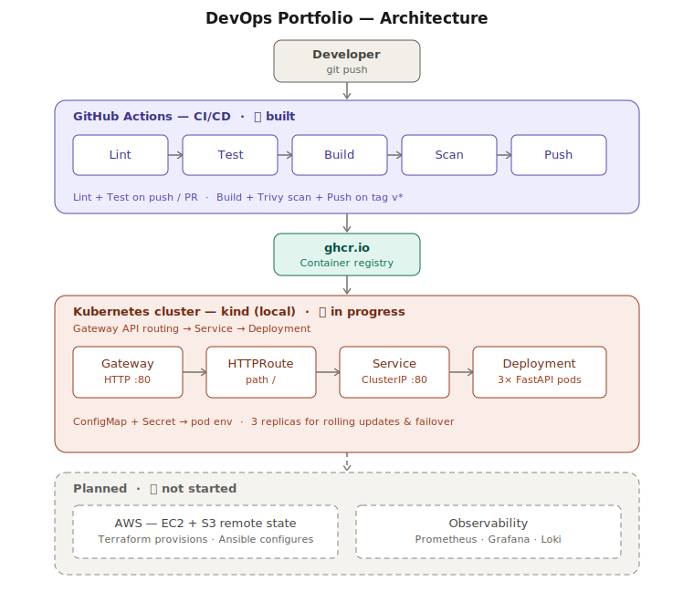

# DevOps Portfolio

I plan to have a small fastapi app deployed end-to-end through a modern DevOps toolchain, containerised with Docker, orchestrated with Kubernetes, provisioned on AWS with Terraform, configured with Ansible, and wired together by a GitHub Actions CI/CD pipeline. I'll build this as a learning project from scratch independently, then use Claude Code to audit the final product for security risks and best-practices to see where I can improve.



## What this project demonstrates

A single FastAPI service taken through a real DevOps toolchain — containerised, tested and scanned in CI, then deployed to Kubernetes. Built from scratch, one phase at a time.

**Built so far**

- **Containerisation** — FastAPI app packaged with Docker on a slim Python base, with a `.dockerignore` to keep the image small and free of local/secret files
- **CI/CD** — GitHub Actions: lint + test on every push and PR, plus a release pipeline that builds, Trivy-scans, then pushes the image to GHCR on version tags
- **Orchestration** — Kubernetes manifests on a local `kind` cluster: a 3-replica Deployment behind a ClusterIP Service, exposed with the Gateway API (Gateway + HTTPRoute), plus ConfigMap and Secret for configuration

**Coming next**

- Helm packaging of the Kubernetes manifests
- AWS infrastructure with Terraform (EC2 + remote state in S3)
- Ansible to configure the host
- Observability with Prometheus, Grafana and Loki
- A final AI-assisted security and best-practice review

## Project status

| Phase | Area | Status |
|---|---|---|
| 1 | FastAPI app + Docker | ✅ Done |
| 2 | GitHub Actions CI/CD | ✅ Done |
| 3 | Kubernetes on `kind` | 🚧 Manifests done · Helm in progress |
| 4 | Terraform on AWS | 📋 Planned |
| 5 | Ansible configuration | 📋 Planned |
| 6 | Observability (Prometheus / Grafana / Loki) | 📋 Planned |

## Tech stack

| Layer | Tool |
|---|---|
| Application | Python 3.14, FastAPI, Uvicorn |
| Testing & linting | pytest, Ruff |
| Containers | Docker |
| Orchestration | Kubernetes (kind), Gateway API, Helm *(in progress)* |
| CI/CD | GitHub Actions |
| Registry | GitHub Container Registry (ghcr.io) |
| Image scanning | Trivy |
| Cloud & IaC | AWS (EC2, S3), Terraform *(planned)* |
| Config management | Ansible *(planned)* |
| Observability | Prometheus, Grafana, Loki *(planned)* |

## Repository structure

```
.
├── myapp/              # FastAPI app, Dockerfile, tests
├── k8s/
│   ├── raw/            # Kubernetes manifests (Deployment, Service, Gateway, HTTPRoute, ConfigMap, Secret)
│   └── helm/           # Helm chart (in progress)
├── terraform/          # AWS infrastructure as code (planned)
├── ansible/            # Host configuration playbooks (planned)
├── observability/      # Prometheus, Grafana, Loki configuration (planned)
├── .github/workflows/  # CI/CD pipelines
└── docs/               # Architecture diagram and ADRs
```

## Getting started

### Prerequisites

- Python 3.14+
- Docker
- `kind` + `kubectl` (only for the Kubernetes deployment)

### Run the app locally

```bash
# Clone and enter the repo
git clone https://github.com/danielodriscoll/devops-portfolio.git
cd devops-portfolio

# Set up the Python environment
python3 -m venv .venv
source .venv/bin/activate
pip install -r myapp/requirements.txt

# Start the dev server (http://localhost:8000)
fastapi dev myapp/main.py

# In another terminal, verify it's running
curl localhost:8000/health
```

### Run with Docker

```bash
cd myapp
docker build -t devops-portfolio .
docker run -p 8080:80 devops-portfolio

curl localhost:8080/health
```

### Run the tests

```bash
pytest -v
```

### Deploy to a local Kubernetes cluster

```bash
# Spin up a local cluster
kind create cluster

# Install the Gateway API CRDs and an nginx Gateway controller first,
# then apply the manifests
kubectl apply -f k8s/raw/

# Check the 3 pods come up
kubectl get pods

# Port-forward the service and hit the app
kubectl port-forward service/fastapi-app 8080:80
curl localhost:8080/health
```

### Deploy to AWS

*(Phase 4 — coming soon)*

## Build phases

This project will be built incrementally. Each tagged release reflects the completion of one phase.

- [x] **Phase 1** — Fastapi app + Docker
- [x] **Phase 2** — GitHub Actions CI/CD pipeline
- [ ] **Phase 3** — Kubernetes deployment (kind + Helm)
- [ ] **Phase 4** — AWS infrastructure with Terraform
- [ ] **Phase 5** — Ansible configuration management
- [ ] **Phase 6** — Observability (Prometheus, Grafana, Loki)
- [ ] **Phase 7** — Polish, ADRs, documentation
- [ ] **Phase 8** — AI-assisted code review and hardening

## Architecture decisions

Key decisions and trade-offs are documented in [`docs/decisions.md`](docs/decisions.md).

## What I learned

*(Update as I complete each phase.)*

### Phase 1 — FastAPI app + Docker

- Used the `python:3.14-slim` base image instead of the full image — smaller container, less surface area, fewer CVEs for Trivy to flag later.
- A `.dockerignore` matters even this early — it keeps the venv, caches and local files out of the image so it stays small and doesn't ship anything I don't want in there.
- Added a `/health` endpoint from the start, since that's what Kubernetes uses for liveness/readiness probes in Phase 3 — cheaper to build it in now than bolt it on later.
- Wrote tests for the happy paths and a 404 so the Phase 2 pipeline has something real to check before it ever builds an image.
- The container listens on port 80 internally, so I map it with `-p 8080:80` when running locally to avoid clashing with other things.

### Phase 2 — CI/CD

*(
- Using `cache: 'pip'` makes the pipeline faster by restoring dependencies instead of downloading each run.

- Set up branch rules so features can't merge to main unless lint, test and docker-build pass. Also blocks force pushes and deletion of main.

- Scanning an image after pushing it to a registry defeats the point. Changed the flow to lint, test, docker, where docker builds and scans before pushing, and only pushes on main.

- A lot of failed runs were things I could have checked locally first. Running commands like `ruff check .` and `pytest` before pushing saves the push and wait cycle.

- Trivy shows what CVEs are in an image. Learned the difference between fixable and unfixable ones, and that severity doesn't always mean real risk. Learned to work around unfixable errors.

- `.gitignore` won't hide sensitive info on Docker image, use dockerignore file)*

- Combining lint, pytest and docker build was causing mulitple slow runs together on every push, instead spilt into two worfklows and docker only runs on a pushed tag e.g v0.1.0

- 

### Phase 3 — Kubernetes deployment (kind + Helm)

## Final review and hardening

After completing all build phases, this project went through a comprehensive code review using Claude Code. The goal was to treat the finished repo the way a senior engineer would on a real PR -> looking for vulnerabilities, anti-patterns, and improvements I'd missed.

Findings, the changes I made in response, and anything I deliberately *didn't* change (and why) are documented in [`docs/review.md`](docs/review.md).(Phase8)

This step happened **after** the project was built, the code, decisions, and structure throughout the phases are mine. The review was a final quality gate, not a co-author.

## License

MIT — see [LICENSE](LICENSE).

## About me

Built by [Daniel O'Driscoll](https://github.com/danielodriscoll) — recent graduate, [link to published research](https://link.springer.com/chapter/10.1007/978-3-032-07938-1_16), [link to LinkedIn](www.linkedin.com/in/danielodriscoll1999).
