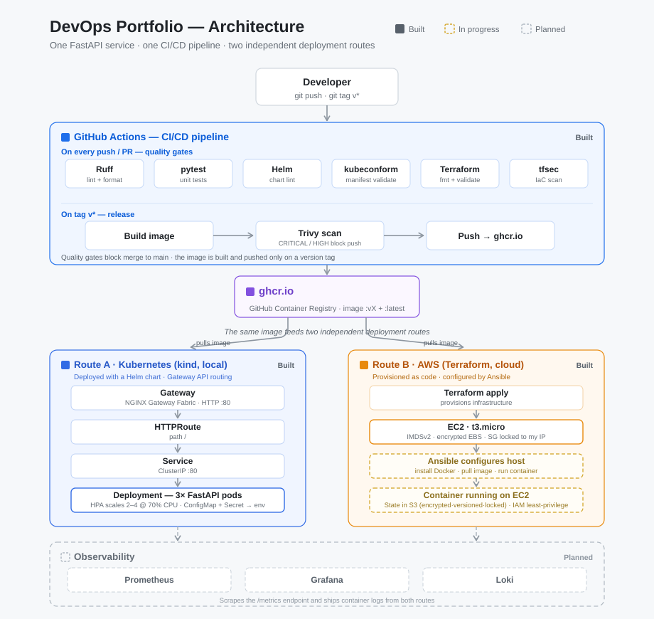

# DevOps Portfolio

I plan to have a small fastapi app deployed end-to-end through a modern DevOps toolchain, containerised with Docker, orchestrated with Kubernetes, provisioned on AWS with Terraform, configured with Ansible, and wired together by a GitHub Actions CI/CD pipeline. I'll build this as a learning project from scratch independently, then use Claude Code to audit the final product for security risks and best-practices to see where I can improve.



## What this project demonstrates

A single FastAPI service taken through a real DevOps toolchain, containerised, tested and scanned in CI, then deployed to Kubernetes. Built from scratch, one phase at a time.

**Built so far**
 
- **Containerisation** → FastAPI app packaged with Docker using a multi-stage build on a slim Python base, with a `.dockerignore` to keep the image small and free of local/secret files
- **CI/CD** → GitHub Actions: lint and test on every push and PR, plus a release pipeline that builds, Trivy-scans, then pushes the image to GHCR on version tags
- **Orchestration** → FastAPI service on a local `kind` cluster, packaged as a Helm chart: a Deployment behind a ClusterIP Service, exposed with the Gateway API (Gateway + HTTPRoute via NGINX Gateway Fabric), with ConfigMap and Secret for configuration, and a HorizontalPodAutoscaler that scales on CPU load
- **Infrastructure as Code** → real AWS infrastructure provisioned with Terraform: an EC2 instance with SSH locked to my IP, encrypted root disk, IMDSv2 enforced, sitting behind a security group. Remote state stored in an encrypted, versioned S3 bucket with native S3 locking. IAM configured with a least-privilege user, not root
- **Manifest validation** → `helm lint` and `kubeconform` run in CI for Kubernetes/Helm; `terraform fmt`, `terraform validate`, and `tfsec` run in CI for Terraform, catching config issues and security misconfigurations before merge
**Coming next**
 
- Ansible to configure the EC2 (install Docker, pull the image, run the container)
- Observability with Prometheus, Grafana and Loki
- A final AI-assisted security and best-practice review
| Phase | Area | Status |
|---|---|---|
| 1 | FastAPI app + Docker | ✅ Done |
| 2 | GitHub Actions CI/CD | ✅ Done |
| 3 | Kubernetes on `kind` (Helm + Gateway API + HPA) | ✅ Done |
| 4 | Terraform on AWS (EC2 + S3 remote state + tfsec) | ✅ Done |
| 5 | Ansible configuration | 🚧 In progress |
| 6 | Observability (Prometheus / Grafana / Loki) | 📋 Planned |
 
## Tech stack
 
| Layer | Tool |
|---|---|
| Application | Python 3.14, FastAPI, Uvicorn |
| Testing & linting | pytest, Ruff |
| Containers | Docker |
| Orchestration | Kubernetes (kind), Gateway API, Helm |
| CI/CD | GitHub Actions |
| Registry | GitHub Container Registry (ghcr.io) |
| Image scanning | Trivy |
| Cloud & IaC | AWS (EC2, S3, IAM), Terraform, tfsec |
| Config management | Ansible *(planned)* |
| Observability | Prometheus, Grafana, Loki *(planned)* |

## Repository structure

```
.
├── myapp/              # FastAPI app, Dockerfile, tests
├── k8s/
│   └── helm/           # Helm chart (Deployment, Service, Gateway, HTTPRoute, ConfigMap, Secret, HPA)
── terraform/
│   ├── bootstrap/      # One-off config that creates the S3 state bucket
│   └── *.tf            # Main config: EC2, security group, key pair, backend
├── ansible/            # Host configuration playbooks (planned)
├── observability/      # Prometheus, Grafana, Loki configuration (planned)
├── .github/workflows/  # CI/CD pipelines
└── docs/               # Architecture diagram and ADRs

```

## Getting started

### Prerequisites

- Python 3.14+
- Docker
- `kind` + `kubectl` (only for the Kubernetes deployment)
- `helm` (only for the Kubernetes deployment)
- `terraform` + AWS CLI (only for the AWS deployment)

### Run the app locally

```bash
# Clone and enter the repo
git clone https://github.com/danielodriscoll/devops-portfolio.git
cd devops-portfolio

# Set up the Python environment
python3 -m venv .venv
source .venv/bin/activate
pip install -r myapp/requirements.txt

# Start the dev server (http://localhost:8000)
fastapi dev myapp/main.py

# In another terminal, verify it's running
curl localhost:8000/health
```

### Run with Docker

```bash
cd myapp
docker build -t devops-portfolio .
docker run -p 8080:80 devops-portfolio

curl localhost:8080/health
```

### Run the tests

```bash
pytest -v
```

### Deploy to a local Kubernetes cluster

```bash
# Spin up a local cluster
kind create cluster

# Install the Gateway API CRDs and NGINX Gateway Fabric controller first, then:
helm install fastapi-app ./k8s/helm/fastapi-app

# Check the pods come up
kubectl get pods

# Port-forward the Gateway and hit the app
kubectl port-forward -n nginx-gateway svc/ngf-nginx-gateway-fabric 8080:80
curl localhost:8080/health
```

### Deploy to AWS with Terraform
 
```bash
# Bootstrap the state bucket (only needed once, ever)
cd terraform/bootstrap
terraform init
terraform apply
 
# Deploy the main infrastructure (EC2 + security group + key pair)
cd ../
terraform init          # picks up the S3 backend
terraform plan          # review before applying
terraform apply         # creates the EC2 — real resources, real (small) cost
 
# Get the public IP and SSH in
terraform output instance_public_ip
ssh -i ~/.ssh/id_ed25519 ec2-user@<public-ip>
 
# Tear it down when done for the session — EC2 bills per hour
terraform destroy
```
 
You'll need a `terraform/terraform.tfvars` file with your public IP and SSH public key (both gitignored):
```hcl
my_ip          = "YOUR.IP/32"
ssh_public_key = "ssh-ed25519 AAAA..."
```

## Build phases

This project will be built incrementally. Each tagged release reflects the completion of one phase.

- [x] **Phase 1** — Fastapi app + Docker
- [x] **Phase 2** — GitHub Actions CI/CD pipeline
- [x] **Phase 3** — Kubernetes deployment (kind + Helm)
- [x] **Phase 4** — AWS infrastructure with Terraform
- [ ] **Phase 5** — Ansible configuration management
- [ ] **Phase 6** — Observability (Prometheus, Grafana, Loki)
- [ ] **Phase 7** — Polish, ADRs, documentation
- [ ] **Phase 8** — AI-assisted code review and hardening

## Architecture decisions

Key decisions and trade-offs are documented in [`docs/decisions.md`](docs/decisions.md).

## What I learned

*(Update as I complete each phase.)*

### Phase 1 — FastAPI app + Docker

- Used the `python:3.14-slim` base image instead of the full image → smaller container, less surface area, fewer CVEs for Trivy to flag later.
- A `.dockerignore` matters even this early → it keeps the venv, caches and local files out of the image so it stays small and doesn't ship anything I don't want in there.
- Added a `/health` endpoint from the start, since that's what Kubernetes uses for liveness/readiness probes in Phase 3 → cheaper to build it in now than bolt it on later.
- Wrote tests for the happy paths and a 404 so the Phase 2 pipeline has something real to check before it ever builds an image.
- The container listens on port 80 internally, so I map it with `-p 8080:80` when running locally to avoid clashing with other things.

### Phase 2 — CI/CD

- Using `cache: 'pip'` makes the pipeline faster by restoring dependencies instead of downloading each run.
- Set up branch rules so features can't merge to main unless lint, test and docker-build pass. Also blocks force pushes and deletion of main.
- Scanning an image after pushing it to a registry defeats the point. Changed the flow to lint, test, docker, where docker builds and scans before pushing, and only pushes on main.
- A lot of failed runs were things I could have checked locally first. Running commands like `ruff check .` and `pytest` before pushing saves the push and wait cycle.
- Trivy shows what CVEs are in an image. Learned the difference between fixable and unfixable ones, and that severity doesn't always mean real risk. Learned to work around unfixable errors.
- `.gitignore` won't hide sensitive info on a Docker image, use a `.dockerignore` file.
- Combining lint, pytest and docker build was causing multiple slow runs together on every push. Split into two workflows, and docker only runs on a pushed tag e.g. `v0.1.0`.

### Phase 3 — Kubernetes deployment (kind + Helm)

- `kind` runs a real Kubernetes cluster inside Docker; `kubectl` is how you talk to it. Rolling out a new image version (via `kubectl set image` or an updated Deployment) scales pods up by one then removes an old one, keeping the app available throughout, and rollouts are tagged so you can revert.
- Chose the Gateway API over Ingress: it separates infrastructure ownership (the Gateway) from application routing (the HTTPRoute) using proper typed fields instead of vendor-specific annotations, and the community `ingress-nginx` controller reached end of life in March 2026.
- Converted the hardcoded raw manifests into a Helm chart → templated values with a single `values.yaml`, so changing config no longer means editing every file. Removed the raw files afterward to avoid confusion; the templated placeholders are harder to read, but the reusability, rollback, and single source of truth are worth it.
- Hit a Helm ownership error: it refused to adopt a Service that already existed from an earlier `kubectl apply`, because it lacked Helm's management labels. Fixed by deleting the raw objects first, then letting Helm create everything fresh with proper ownership metadata.
- The HorizontalPodAutoscaler needs `metrics-server` to read pod CPU/memory. On `kind` it failed its readiness check with a 500 because kubelet's self-signed certs aren't trusted by default → patched it with `--kubelet-insecure-tls`, acceptable for local dev but not production.
- When the HPA is active it overrides the replica count set in the Deployment/values → I set 3, it scaled down to my configured minimum of 2 based on real CPU usage.
- Load-tested with `hey` (10 concurrent users for 60s through the Gateway) to push CPU past the 70% target → watched the HPA scale from 2 to 4 replicas, then back down after a ~5 minute cooldown. Used `kubectl port-forward` to point a laptop port at the Gateway for the test.
- Added `helm lint` and `kubeconform` as CI jobs. Helm's `{{ }}` templating isn't valid Kubernetes YAML, so `helm template` renders it to a plain file first, which kubeconform then validates. Gateway/HTTPRoute aren't core Kubernetes types, so kubeconform needs `-schema-location` pointing at a CRD schema catalogue to validate them.
- Installed kubeconform via its official release binary rather than a community GitHub Action → for a trivial download, rolling it myself avoids adding an unvetted third-party dependency to the pipeline (unlike `azure/setup-helm`, which is an official Microsoft action).
- Trivy caught that my `requirements.txt` (generated with `pip freeze`) was shipping unrelated tooling (Ansible, pytest, ruff) inside the production image, causing both bloat and vulnerabilities. Split into a runtime `requirements.txt` and a separate dev/test one; the image installs only runtime deps, CI installs both.
- The remaining Trivy findings weren't my code at all → they were outdated build tools (`setuptools`, `wheel`) baked into the `python:3.14-slim` base image. Rewrote the Dockerfile as a multi-stage build so build tooling stays in a throwaway stage and never reaches the final image, and stripped the leftover build tools from the runtime stage to clear the last vendored-copy CVEs.
- Learned the practical shape of vulnerability management: you don't fix it once. Some findings are unfixable (awaiting upstream), some aren't real risk in context, and the goal is to patch what you cleanly can, minimise attack surface, and document the rest.

### Phase 4 — AWS infrastructure with Terraform
 
- New AWS accounts (post-July 2025) are on a credit-based Free plan → $100 in credits at signup, up to $200 with onboarding tasks, six-month lifespan. Different from the old 12-month free tier that most tutorials still describe. The upside: the Free plan can't surprise-bill; if credits run out the account just stops.
- Cost safety comes first, before anything is provisioned: a $1 AWS Budget alert, Free Tier usage alerts, and the habit of `terraform destroy` at the end of every session. The real traps aren't the EC2 itself but the surrounding bits (Elastic IPs, NAT Gateways, orphaned EBS volumes) that keep billing after you think you're clean.
- Created a dedicated IAM user (`terraform-user`) with programmatic access keys instead of using root credentials. Root should never touch Terraform → if those keys leak, the whole account is gone. The IAM user gets narrower permissions and a separate credential lifecycle.
- Chicken-and-egg problem with remote state: Terraform's backend config is read *before* it creates anything, so I can't store state in an S3 bucket that Terraform itself hasn't created yet. Solved with a two-step bootstrap → a small `terraform/bootstrap/` config with local state creates the S3 bucket (versioned, encrypted, public access blocked), then the main config's `backend.tf` points at that now-existing bucket for remote state.
- State is Terraform's *memory* of what it has built — it downloads state at the start of each run, compares against my `.tf` code, and computes the minimal diff. That's what makes Terraform declarative rather than imperative: I describe the desired end state, and it figures out what to change (in-place update, replace, destroy) with `~` and `-/+` symbols in the plan.
- `variables.tf` declares what inputs the config needs; the actual values go in `terraform.tfvars`, which is gitignored. Same config-vs-value split as Helm's `values.yaml`, same reason: the declaration is public (safe to commit), the values are private (my IP, my SSH public key). Inline comments in `.gitignore` broke the pattern match and nearly leaked my IP → moved them to separate lines.
- Reading files from local paths (`file("~/.ssh/id_ed25519.pub")`) breaks CI, because the runner doesn't have my SSH key. Refactored to pass the public key as a variable → same effect, no filesystem dependency, config runs anywhere.
- Home broadband IPs change → SSH suddenly stopped working one morning until I updated `terraform.tfvars` with the new IP and re-applied. Terraform's diff was `1 to change`, not `3 to add`: it modified the security group rule in place and left the EC2 untouched. Concrete demonstration of state doing its job.
- An EC2 instance has two IPs at once — a public one (how the internet reaches it) and a private one (AWS-internal networking). SSH connects via the public IP; the shell prompt shows the private one as the machine's internal hostname. Together with my own IP (in the firewall rule), there were three IPs in play during a single SSH session.
- Followed the principle of least exposure: locked *both* SSH and HTTP to my IP during testing, rather than opening HTTP to `0.0.0.0/0` from the start. Opening a port publicly should be a deliberate decision, not a default.
- Added Terraform validation to CI as two separate jobs: `terraform-validate` runs `fmt -check` and `validate` (using `init -backend=false` so it needs no AWS credentials), and `terraform-security` runs `tfsec` to catch misconfigurations. IaC equivalent of Trivy scanning Docker images.
- Hardened the EC2 based on tfsec findings: enabled IMDSv2 (blocks SSRF attacks from stealing IAM credentials via the metadata service — the mechanism behind the 2019 Capital One breach) and encrypted the root EBS volume at rest (compliance baseline, free with one flag). Documented and ignored the open-egress finding with an inline `#tfsec:ignore` and prose comment explaining why → the server needs outbound to pull updates and images, egress filtering would be defence-in-depth but is out of scope.
- Same triage discipline as Trivy in Phase 3: fix what's cheap and real, document-and-accept what's a deliberate trade-off, defer the rest with rationale. That decision trail matters more than a green scan.

## Final review and hardening

After completing all build phases, this project went through a comprehensive code review using Claude Code. The goal was to treat the finished repo the way a senior engineer would on a real PR → looking for vulnerabilities, anti-patterns, and improvements I'd missed.

Findings, the changes I made in response, and anything I deliberately *didn't* change (and why) are documented in [`docs/review.md`](docs/review.md). (Phase 8)

This step happened **after** the project was built; the code, decisions, and structure throughout the phases are mine. The review was a final quality gate, not a co-author.

## License

MIT — see [LICENSE](LICENSE).

## About me

Built by [Daniel O'Driscoll](https://github.com/danielodriscoll) — [link to published research](https://link.springer.com/chapter/10.1007/978-3-032-07938-1_16), [link to LinkedIn](www.linkedin.com/in/danielodriscoll1999).