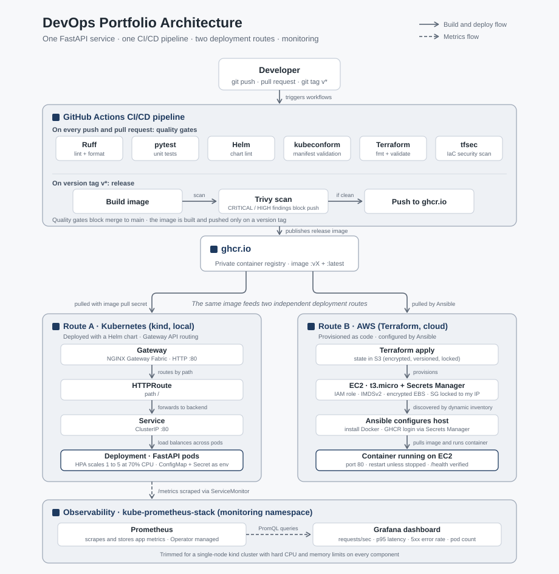
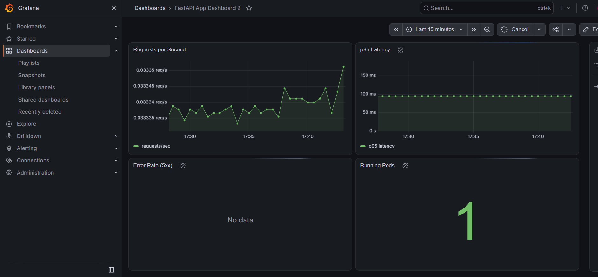

# DevOps Portfolio

A small FastAPI app deployed end-to-end through a modern DevOps toolchain: containerised with Docker, orchestrated with Kubernetes, provisioned on AWS with Terraform, configured with Ansible, monitored with Prometheus and Grafana, and wired together by a GitHub Actions CI/CD pipeline. I built this as a learning project from scratch independently. It's made up of 8 phases with the final phase using Claude Code to audit the final product like a senior engineer would and identify any missed security risks or potential better best practices to see where I can improve and learn from.



## See it working

A 90-second load test (8 concurrent users) through the Gateway on the `kind` cluster. CPU passes the HPA's 70% target, Kubernetes scales the app from 1 to 5 pods, and Prometheus and Grafana capture the traffic as it happens.

| Grafana: traffic spike and pods scaling | HPA: CPU past target, replicas 1 → 5 |
|---|---|
|  |  |

<details>
<summary>Dashboard before the load test</summary>



</details>

## Roadmap

| Phase | Area | Status |
|---|---|---|
| 1 | FastAPI app + Docker | ✅ Done |
| 2 | GitHub Actions CI/CD | ✅ Done |
| 3 | Kubernetes on `kind` (Helm + Gateway API + HPA) | ✅ Done |
| 4 | Terraform on AWS (EC2 + S3 remote state + tfsec) | ✅ Done |
| 5 | Ansible configuration (+ AWS Secrets Manager, EC2 IAM role) | ✅ Done |
| 6 | Observability (Prometheus / Grafana) | ✅ Done |
| 7 | Clean up, ADRs, documentation | 📋 Planned |
| 8 | AI-assisted code review and hardening | 📋 Planned |

## What this project demonstrates

| Skill | What it shows |
|---|---|
| **Containerisation** | FastAPI app packaged with Docker using a multi-stage build on a slim Python base. `.dockerignore` keeps the image small and free of local/secret files |
| **CI/CD** | GitHub Actions lints and tests on every push and PR to `main`. A release pipeline builds, Trivy-scans, then pushes the image to a private GHCR repo on version tags |
| **Orchestration** | Helm chart on a local `kind` cluster: Deployment behind a ClusterIP Service, exposed via Gateway API (Gateway + HTTPRoute, NGINX Gateway Fabric). ConfigMap and Secret for config, HPA scaling on CPU |
| **Infrastructure as Code** | Terraform provisions an EC2 instance with SSH locked to my IP, encrypted root disk, IMDSv2 enforced, behind a security group. Remote state in an encrypted, versioned S3 bucket with native locking. Least-privilege IAM user, not root |
| **Configuration management** | Ansible installs Docker, logs in to GHCR using a token from AWS Secrets Manager, pulls the private image, runs the container and health checks it. AWS dynamic inventory, so no IPs are hardcoded |
| **Manifest validation** | CI runs `helm lint` and `kubeconform` for Kubernetes/Helm, and `terraform fmt`, `terraform validate` and `tfsec` for Terraform, catching config issues and security misconfigurations before merge |
| **Observability** | Trimmed `kube-prometheus-stack` on `kind`. Prometheus discovers the app via a ServiceMonitor in the Helm chart. Grafana dashboard tracks requests/sec, p95 latency, error rate and running pod count |
 
## Tech stack
 
| Layer | Tool |
|---|---|
| Application | Python 3.14, FastAPI, Uvicorn |
| Testing & linting | pytest (+ httpx test client), Ruff |
| Containers | Docker (multi-stage build, `python:3.14-slim`) |
| Orchestration | Kubernetes (kind), Helm, Gateway API (NGINX Gateway Fabric), HPA + metrics-server |
| CI/CD | GitHub Actions |
| Registry | GitHub Container Registry (ghcr.io, private) |
| Security & validation | Trivy (images), tfsec (Terraform), kubeconform + `helm lint` (manifests) |
| Cloud & IaC | AWS (EC2 on Amazon Linux 2023, S3, IAM, Secrets Manager), Terraform |
| Config management | Ansible (`amazon.aws` dynamic inventory, `community.docker`) |
| Observability | Prometheus, Grafana (kube-prometheus-stack), prometheus-fastapi-instrumentator |
| Load testing | `hey` |

## Repository structure

Folders are listed in the order they're built, with the phase that introduces each one.

```
.
├── myapp/                           Phase 1 · the application
│   ├── main.py                        FastAPI app: /, /health, /metrics
│   ├── tests/                         pytest suite
│   ├── Dockerfile                     multi-stage build on python:3.14-slim
│   └── requirements*.txt              runtime deps / dev + test deps
│
├── .github/workflows/               Phase 2 · CI/CD
│   ├── ci.yml                         lint, test, helm lint, kubeconform, terraform validate, tfsec
│   └── push-image.yml                 on version tags: build → Trivy scan → push to GHCR
│
├── k8s/helm/fastapi-app/            Phase 3 · Kubernetes
│   ├── values.yaml                    the one file to edit (image, replicas, resources, HPA)
│   ├── templates/                     Deployment, Service, Gateway, HTTPRoute, ConfigMap,
│   │                                  Secret, HPA, ServiceMonitor
│   └── README.md                      full cluster rebuild guide + troubleshooting
│
├── terraform/                       Phase 4 · AWS infrastructure
│   ├── bootstrap/                     run once: creates the S3 bucket for remote state
│   ├── main.tf                        EC2, security group, key pair, IAM role, Secrets Manager
│   ├── variables.tf / outputs.tf      inputs (values go in gitignored terraform.tfvars) / public IP
│   └── backend.tf                     points state at the bootstrap bucket
│
├── ansible/                         Phase 5 · configuration
│   ├── playbook.yml                   install Docker, pull private image, run + health check
│   ├── inventory.aws_ec2.yml          finds the EC2 by tag, so no hardcoded IPs
│   └── ansible.cfg, requirements.yml
│
├── observability/                   Phase 6 · monitoring
│   ├── values-prometheus.yaml         trimmed kube-prometheus-stack for a laptop
│   └── dashboards/fastapi.json        Grafana dashboard (traffic, latency, errors, pods)
│
└── docs/                            write-ups
    ├── setup/                         step-by-step setup guides, one per phase
    ├── decisions.md                   architecture decisions and trade-offs
    ├── What-I-Learned.md              lessons from each phase
    └── images/                        screenshots
```

## Getting started

**Quick start:** run the app in a container (needs only Docker):

```bash
git clone https://github.com/danielodriscoll/devops-portfolio.git
cd devops-portfolio
docker build -t devops-portfolio myapp
docker run --rm -p 8080:80 devops-portfolio
curl localhost:8080/health      # {"status":"ok"}
```

**Build it yourself, phase by phase.** Each guide picks up where the last one left off and ends with a ✅ checkpoint, so you know it worked before moving on.

| Phase | Guide |
|---|---|
| 0 | [Before you start: tools, forking, security ground rules](docs/setup/setup-phase-0.md)
| 1 | [FastAPI app + Docker](docs/setup/setup-phase-1.md)
| 2 | [CI/CD with GitHub Actions](docs/setup/setup-phase-2.md)
| 3 | [Kubernetes on kind (Helm, Gateway API, HPA)](docs/setup/setup-phase-3.md)
| 4 | [AWS infrastructure with Terraform](docs/setup/setup-phase-4.md)
| 5 | [Configure the EC2 with Ansible](docs/setup/setup-phase-5.md)
| 6 | [Observability with Prometheus and Grafana](docs/setup/setup-phase-6.md)


## Architecture decisions
*(Updated as I complete each phase.)*

Key decisions and trade-offs are documented in [`docs/decisions.md`](docs/decisions.md).

## What I learned

*(Updated as I complete each phase.)*

[`docs/What-I-Learned.md`](docs/What-I-Learned.md).

## Final review and hardening

After completing all build phases, this project will go through a comprehensive code review using Claude Code. The goal is to treat the finished repo the way a senior engineer would on a real PR → looking for vulnerabilities, anti-patterns, and improvements I'd missed.

Findings, the changes I made in response, and anything I deliberately *didn't* change (and why) will be documented in [`docs/review.md`](docs/review.md). (Phase 8)

This step happens **after** the project is built and cleaned up; the code, decisions, and structure throughout the phases are mine. The review is a final quality gate, not a co-author.

## License

MIT, see [LICENSE](LICENSE).

## About me

Built by [Daniel O'Driscoll](https://github.com/danielodriscoll) | [Published research](https://link.springer.com/chapter/10.1007/978-3-032-07938-1_16) | [LinkedIn](https://www.linkedin.com/in/danielodriscoll1999)
