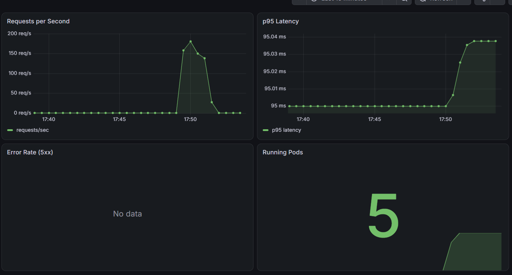
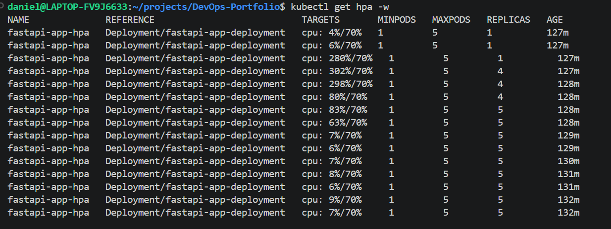

# Phase 6: Observability with Prometheus and Grafana

[← Phase 5](setup-phase-5.md) · [All phases](../../README.md#getting-started)

This runs on the `kind` cluster from [Phase 3](setup-phase-3.md).

## 1. Install the trimmed monitoring stack

The default `kube-prometheus-stack` will overwhelm a laptop. [`observability/values-prometheus.yaml`](../../observability/values-prometheus.yaml) keeps only Prometheus, Grafana and the Operator, with hard resource limits.

```bash
helm repo add prometheus-community https://prometheus-community.github.io/helm-charts
helm repo update

helm install kube-prom-stack prometheus-community/kube-prometheus-stack \
  --namespace monitoring --create-namespace \
  -f observability/values-prometheus.yaml

kubectl get pods -n monitoring -w     # wait until Grafana is 3/3 Running, then Ctrl+C
```

If you skipped Phase 3 step 5 because of the ServiceMonitor, [install the app chart](setup-phase-3.md#5-install-the-app-chart) now.

## 2. Confirm Prometheus is scraping the app

```bash
kubectl port-forward -n monitoring svc/kube-prom-stack-kube-prome-prometheus 9090:9090
```

Open http://localhost:9090/targets. The `fastapi-app` target should be **UP**.

## 3. Open Grafana and import the dashboard

```bash
kubectl port-forward -n monitoring svc/kube-prom-stack-grafana 3000:80

# Admin password (generated per install, so print it rather than storing it)
kubectl get secret -n monitoring kube-prom-stack-grafana \
  -o jsonpath="{.data.admin-password}" | base64 -d; echo
```

Log in at http://localhost:3000 as `admin`, then go to **Dashboards → New → Import**, upload [`observability/dashboards/fastapi.json`](../../observability/dashboards/fastapi.json) and choose the Prometheus data source.

## 4. Load test and watch it scale

Use three terminals:

```bash
# Terminal 1: the Gateway (it load-balances across all pods, unlike a port-forward to one pod)
kubectl port-forward -n nginx-gateway svc/ngf-nginx-gateway-fabric 8080:80

# Terminal 2: watch the autoscaler
kubectl get hpa -w

# Terminal 3: 8 concurrent clients for 90s (install with: sudo apt install hey)
hey -z 90s -c 8 http://localhost:8080/
```

✅ **Checkpoint:** requests/sec and p95 latency spike on the dashboard, the HPA's CPU goes past 70%, and Running Pods climbs towards 5, then drops back about 5 minutes after the test ends. It should look like this:

| Grafana during the load test | HPA scaling out |
|---|---|
|  |  |

---

## Tearing everything down

```bash
kind delete cluster --name devops-portfolio-cluster    # removes the cluster and everything in it
cd terraform && terraform destroy                       # if any AWS resources are still up
```

The state bucket costs pennies and can stay for next time. To remove it for good, empty it in the S3 console first (it's versioned, so delete all object versions too), then run `terraform destroy` in `terraform/bootstrap`. When you're completely finished, delete your GHCR tokens and the IAM user's access key.

Stuck? The [troubleshooting table](../../k8s/helm/fastapi-app/README.md#troubleshooting) covers the issues I hit on the cluster side.

---

[← Phase 5](setup-phase-5.md) · [All phases](../../README.md#getting-started)
